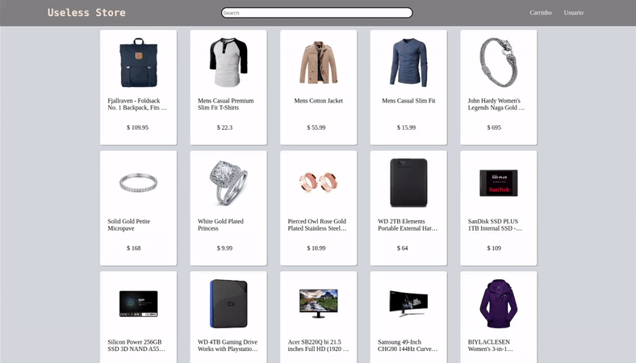

Useless Store
---

Useless Store is my first personal project using React.js as a front-end framework
it's fully responsive with pure CSS and HTML only and it consumes an free online API
from https://fakestoreapi.com/.

React is an amazing framework, it doesn't has an steep learning curve, although getting
used to JSX isn't friendly at the start, but as soon as you get the point it's just 
javascrpt embedded with html. 

---

## You can see it working here -> http://uselessstore.s3-website-sa-east-1.amazonaws.com/

---
There's a lot of work I will develop but I think it's a great start

###To-do:
- [x] host it on AWS
- [ ] Finish Footer on the main page
- [ ] Build User page
- [ ] Build Cart page
- [ ] Change logo
- [ ] Build Check-out
- [ ] Create own API

